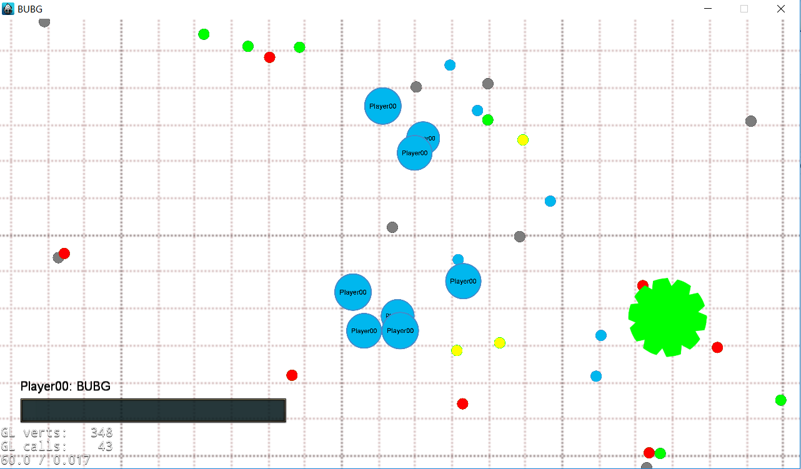

#BUBG 项目文档
***
##游戏简介
* BUBG是一款类似agar.io的游戏，玩家在游戏中将操控自己的小球通过吞噬食物或小球不断成长变大。

##游戏玩法
* 移动方式: 游戏鼠标和键盘两种操控模式，鼠标模式下则是通过鼠标位置来控制小球的移动方向，键盘模式下则是通过方向键或W,S,A,D键来控制移动。
* 分裂按键: 在小球成长到一定程度后，玩家可按下空格键(spacebar)来使小球分裂。
* 菜单按键: 游戏中玩家可按下q键调出菜单栏。

##启动方式
* 服务端启动方式: 由一位玩家作为服务端，在按下开始键后选择创建游戏启动服务端。
* 客户端启动方式: 客户端玩家在按下开始键后选择加入游戏，输入服务端玩家的IP地址进行局域网联机。

##实现功能
###基础功能
* 支持图形显示
* 支持鼠标和键盘操作
* 支持agar.io中的吞噬操作
* 支持agar.io中的分裂操作
* 支持动画
* 实现服务端: 支持局域网联机对战(自由模式)，支持多人在同一个地图上游戏

###附加功能
* 支持病毒
* 支持聊天
* 服务端能抵御作弊，即客户端不能任意传送自己的位置或宣称吞噬了某个细胞等，必须有真实操作。

##游戏截图
